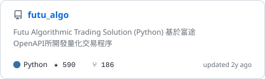
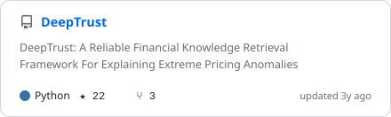
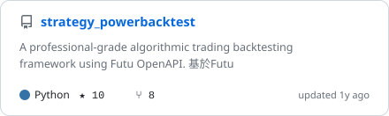
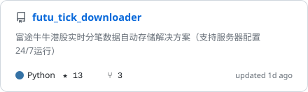
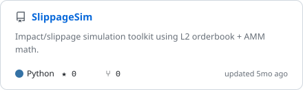
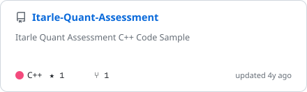
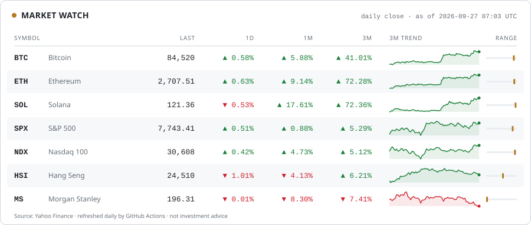
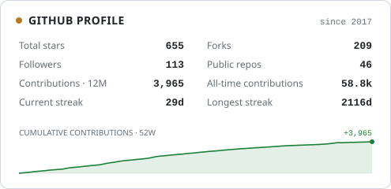
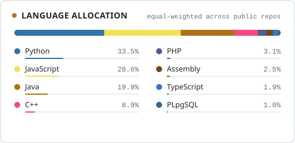
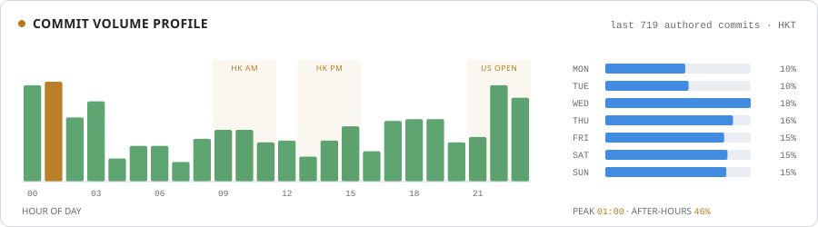

<div align="center">


**Quant Research & Algo Trading · Web3 Infrastructure · Hong Kong**

[](https://www.billpwchan.com)
[](https://www.linkedin.com/in/billpwchan1998/)
[](mailto:billpwchan@hotmail.com)
[](https://www.instagram.com/billpwchan/)
[](https://github.com/billpwchan?tab=followers)
[](https://github.com/billpwchan?tab=repositories&sort=stargazers)

</div>

```python
class BillChan(QuantDeveloper):
    based_in   = "Hong Kong"
    education  = "MSc Computing (Management & Finance), Imperial College London"
    focus      = ["HK/A-share microstructure", "crypto derivatives", "execution infra"]
    building   = "local-first order-flow research terminal"
    open_to    = ["Quant Trading", "Quant Dev", "Fintech / Web3 Infrastructure"]
```

## Featured Work

<table>
<tr>
<td width="50%"><a href="https://github.com/billpwchan/futu_algo"><picture><source media="(prefers-color-scheme: dark)" srcset="asset/generated/repo-futu_algo-dark.svg"></picture></a></td>
<td width="50%"><a href="https://github.com/billpwchan/DeepTrust"><picture><source media="(prefers-color-scheme: dark)" srcset="asset/generated/repo-DeepTrust-dark.svg"></picture></a></td>
</tr>
<tr>
<td><a href="https://github.com/billpwchan/strategy_powerbacktest"><picture><source media="(prefers-color-scheme: dark)" srcset="asset/generated/repo-strategy_powerbacktest-dark.svg"></picture></a></td>
<td><a href="https://github.com/billpwchan/futu_tick_downloader"><picture><source media="(prefers-color-scheme: dark)" srcset="asset/generated/repo-futu_tick_downloader-dark.svg"></picture></a></td>
</tr>
<tr>
<td><a href="https://github.com/billpwchan/SlippageSim"><picture><source media="(prefers-color-scheme: dark)" srcset="asset/generated/repo-SlippageSim-dark.svg"></picture></a></td>
<td><a href="https://github.com/billpwchan/Itarle-Quant-Assessment"><picture><source media="(prefers-color-scheme: dark)" srcset="asset/generated/repo-Itarle-Quant-Assessment-dark.svg"></picture></a></td>
</tr>
</table>

## Market Watch

<picture>
  <source media="(prefers-color-scheme: dark)" srcset="asset/generated/market-dark.svg">
  
</picture>

## Tech Stack

<p align="center">
  
</p>

| Domain | Tools |
|:--|:--|
| **Quant & Trading** | NumPy · Pandas · Polars · Backtrader · QuantLib · TA-Lib · Futu OpenAPI · CCXT |
| **Market Data** | Tick / L2 order book capture · time-series DBs · real-time pipelines · replay engines |
| **Web3** | Solidity · EVM · Web3.py · Ethers.js · on-chain analytics · AMM math |
| **ML / NLP** | PyTorch · scikit-learn · sentiment models · retrieval-augmented financial QA |

## Dashboard

<p>
<picture><source media="(prefers-color-scheme: dark)" srcset="asset/generated/stats-dark.svg"></picture>
<picture><source media="(prefers-color-scheme: dark)" srcset="asset/generated/languages-dark.svg"></picture>
</p>

<picture>
  <source media="(prefers-color-scheme: dark)" srcset="asset/generated/activity-dark.svg">
  
</picture>

<picture>
  <source media="(prefers-color-scheme: dark)" srcset="https://raw.githubusercontent.com/billpwchan/billpwchan/output/snake-dark.svg">
  
</picture>

<details>
<summary><b>Isometric contribution calendar</b></summary>
<br>

</details>

## Recently Active

<!-- RECENT:START -->
| Repository | What it is | Last push |
|:--|:--|:--:|
| [`futu_tick_downloader`](https://github.com/billpwchan/futu_tick_downloader) | 富途牛牛 港股实时分笔数据自动存储解决方案（支持服务器配置24/7运行） | today |
| [`SlippageSim`](https://github.com/billpwchan/SlippageSim) | Impact/slippage simulation toolkit using L2 orderbook + AMM math. | 5mo&nbsp;ago |
| [`Futu_TelegramBot`](https://github.com/billpwchan/Futu_TelegramBot) | — | 5mo&nbsp;ago |
| [`strategy_powerbacktest`](https://github.com/billpwchan/strategy_powerbacktest) | A professional-grade algorithmic trading backtesting framework using Futu OpenAPI. 基於Futu OpenAPI建設的專業回測工具，支持自定義策略編寫 | 1y&nbsp;ago |
| [`Strategy-Trading-Scraper`](https://github.com/billpwchan/Strategy-Trading-Scraper) | Web Scraper for Binance Trading Bot Stats and PnL | 2y&nbsp;ago |
<!-- RECENT:END -->

<div align="center">
<sub>Cards, market data and activity refresh daily via <a href=".github/workflows/main.yml">GitHub Actions</a> · rendered by <a href="scripts/generate.py">scripts/generate.py</a></sub>
</div>
