#  Bill Chan | Quant Research & Algo Trading

**Systematic Trading | Web3 Infrastructure | Market Microstructure**

---

## 🎯 Professional Summary

Quantitative developer and algorithmic trading specialist with expertise in systematic trading systems, derivatives pricing, and onchain data analytics. Currently focused on building high-performance trading infrastructure and sustainable Web3 protocols. Background in computational finance with strong emphasis on market microstructure, NLP for sentiment analysis, and real-time data engineering pipelines.

**Current Focus:** Crypto derivatives trading | DeFi analytics | Backtesting frameworks | Market data infrastructure

---

## 🛠️ Technical Stack

**Quant & Trading**
`Python` `NumPy` `Pandas` `TA-Lib` `Backtrader` `QuantLib` `Market Data APIs`

**Web3 & Blockchain**
`Solidity` `EVM` `DeFi Protocols` `Onchain Analytics` `Web3.py` `Ethers.js`

**Infrastructure & DevOps**
`FastAPI` `Docker` `GitHub Actions` `CI/CD` `Data Pipelines` `Time-Series DB`

**Data & Analytics**
`NLP` `Sentiment Analysis` `Time-Series Analysis` `Statistical Modeling` `Data Visualization`

---

## 📊 Dynamic Metrics Dashboard

| **Core Metrics** | **Activity & Insights** |
|:---:|:---:|
|  |  |
|  |  |
|  |  |
|  |  |
|  |  |

---

## 🚀 Featured Projects

**Trading Systems & Backtesting**
- Systematic trading frameworks with multi-asset support
- Real-time market data processing and signal generation
- Performance attribution and risk analytics

**Web3 & DeFi Analytics**
- Onchain data aggregation and visualization
- Protocol analytics and yield optimization tools
- Sustainable Web3 infrastructure development

**Data Engineering**
- High-frequency data pipelines for market microstructure analysis
- NLP-powered sentiment analysis for crypto markets
- Time-series databases and real-time dashboards

---

## ⚙️ Automated Updates

This README is automatically updated by GitHub Actions via [`.github/workflows/main.yml`](.github/workflows/main.yml).

**Schedule**
- Daily: `01:59 UTC`
- On demand: `workflow_dispatch` (manual run from Actions tab)

**Required Secrets**
- `METRICS_TOKEN`: recommended to use a classic PAT for best compatibility with `lowlighter/metrics`
- `STOCK_TOKEN` (optional): required only for `asset/stock.svg`

**Recommended METRICS_TOKEN scopes (classic PAT)**
- `public_repo`
- `read:user`
- `read:org`
- `repo` (needed if you want broader/private-repo data; otherwise some panels may show `Insufficient token scopes`)

Metrics include:
- **GitHub Activity:** Commits, PRs, issues, and repository statistics
- **Code Analytics:** Language distribution, coding habits, and contribution patterns
- **Market Data:** Stock prices and trading-related metrics
- **Social Metrics:** Stargazers, reactions, and community engagement

**Quick Troubleshooting**
- `Insufficient token scopes` on `base.svg`: usually caused by token permissions; regenerate `METRICS_TOKEN` with scopes above.
- `Unexpected error` on specific panels: run workflow manually once after token refresh; if still failing, disable that panel temporarily and re-enable incrementally.
- Missing `stock.svg`: check `STOCK_TOKEN` exists and is valid.

*Last updated: Auto-refreshed daily at 01:59 UTC*

---

**Open to opportunities in Quantitative Trading | Fintech | Web3 Infrastructure**

